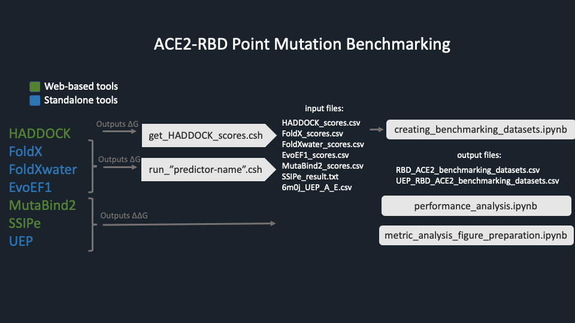

Benchmark of widely used structure-based binding affinity predictors on the variant Spike-ACE2 deep mutational interaction set.

## Motivation

Since the start of COVID-19 pandemic, a huge effort has been devoted to understanding the Spike-ACE2 recognition mechanism. Within this context, two recent deep mutational scanning studies traced the impact of all possible mutations/variants across the Spike-ACE2 interface (Chan et al., 2020; Starr et al., 2020). Expanding on these studies, we benchmarked four widely used structure-based binding affinity predictors (FoldX, EvoEF1, MutaBind2, SSIPe), as well as two naïve predictors (HADDOCK, UEP) on the variant Spike-ACE2 deep mutational interaction set. Upon analyzing the performance of the predictors from several residue-based aspects, we investigated the grounds of the predictors on a viral host-pathogen system like SARS-CoV-2-ACE2. To aid the improvement of the available approaches,  we present our mutant models together with our benchmarking data. 

We used deep mutational scanning coupled with interaction profiling data sets, produced for Spike-RBD (Starr et al., 2020) and human ACE2 (Chan et al.,2020) variants. From these dataset, we concentrated on interface variants. To determine the interface positions, we used 6m0j pdb structure (Lan et al., 2020) with PDBePISA (Schymkowitz et al., 2005). Then, we generated our dataset that contains an equal amount of “enriching” and “depleting” interfacial RBD-ACE2 mutations, totaling 263 mutations (179 ACE2 and 84 Spike-RBD mutations).

For our benchmarking efforts, we used four widely used structure-based binding affinity predictors as the main algorithms: FoldX (also FoldXwater), EvoEF1, Mutabind2, and two naïve predictors: SSIPe and  HADDOCK and UEP. Then, we evaluated the prediction performances of these tools from the perspectives of volume, hydrophobicity, flexibility, and physicochemical property change upon a mutation. 

Here, we presented our bencmarking results with the required scripts for the reporoducibility of this study.

The models and the scores are visualized in https://nzmye.github.io/ace2-rbd-point-mutation-benchmark/visualize/#

## Folder organization of our repository:



We used the stand-alone packages of [FoldX](http://foldxsuite.crg.eu/products#foldx),[EvoEF1](https://github.com/tommyhuangthu/EvoEF) and [UEP](https://github.com/pepamengual/UEP) and run [HADDOCK](https://alcazar.science.uu.nl/services/HADDOCK2.2/), [MutaBind2](https://lilab.jysw.suda.edu.cn/research/mutabind2/), and [SSIPe](https://zhanggroup.org/SSIPe/) on their servers to generate the models.  
### Scripts

run_<predictor> scripts were used to generate FoldX and EvoEF1 models, automatically. UEP is also a standalone tool, but it produces all possible mutations at once, so there is no need for automatization.

#### Shell scripts

- *run_FoldX.csh*: Applies single amino acid mutations and computes binding affinity by using FoldX. (FoldX commands: Repair, BuildModel, AnalyseComplex).
- *run_FoldXwater.csh*: Applies single amino acid mutations and computes binding affinity by using FoldX with water option. (FoldX commands: Repair, BuildModel, AnalyseComplex with water)
- *run_EvoEF1.csh*: Applies single amino acid mutations and computes binding affinity by using EvoEF1. (EvoEF1 commands: RepairStructure, BuildMutant, ComputeBinding).
- *get_HADDOCK_scores.csh*: Greps the predicted HADDOCK energy scores from the raw output files.
- *pdb-tools.csh*: Generates HADDOCK input structures by selecting the first occupancy of atoms in case of the multiple occupancies.

#### Notebooks
  
  - *creating_benchmarking_datasets.ipynb*: Creates SARS_CoV_2_RBD_ACE2_benchmarking_dataset.csv and UEP_SARS_CoV_2_RBD_ACE2_benchmarking_dataset.csv files.  These files contain ∆∆G scores of predictors. 
  - *performance_analysis.ipynb*: Calculates success rates of predictors by using SARS_CoV_2_RBD_ACE2_benchmarking_dataset.csv and UEP_SARS_CoV_2_RBD_ACE2_benchmarking_dataset.csv files.
  - *metric_analyses_figure_preparation.ipynb*: Performs metric analyses (volume, hydrophobicity, flexibility, and physicochemical property change upon a mutation) and visualizes the outputs.


### Files

#### Input files
  - *ACE2_Experimental_dataset.csv*: Experimental binding valus of ACE2 point mutations.
  - *RBD_Experimental_dataset.csv*: Experimental binding valus of RBD point mutations.
  - *HADDOCK_scores.csv*: Binding energy scores (∆G) of HADDOCK on 263 point mutations (+ wild type).
  - *FoldX_scores.csv*: Binding energy scores (∆G) of FoldX on 263 point mutations, each mutations have their own wild type.
  - *FoldXwater_scores.csv*: Binding energy scores (∆G) of FoldX with pdbWaters option on 263 point mutations, each mutation has its own wild type.
  - *EvoEF1_scores.csv*: Binding energy scores (∆G) of EvoEF1 on 263 point mutations (+ wild type).
  - *MutaBind2_scores.csv*: Binding energy change (∆∆G) scores of MutaBind2 on 263 point mutations.
  - *SSIPe_result.txt*: Binding energy change (∆∆G) scores of SSIPe on 263 point mutations.
  - *6m0j_UEP_A_E.csv*: Binding energy change (∆∆G) scores of UEP. 
  
#### Output files

  - *SARS-CoV-2-RBD_ACE2_benchmarking_dataset.csv*: Main dataset of the study, contains predicted affinity change (∆∆G) scores of predictors on 263 point mutaions of SARS-CoV-2 RBD and human ACE2 protein complex (PDB ID: 6m0j).
  - *UEP_SARS-CoV-2-RBD_ACE2_benchmarking_dataset.csv*: UEP calculates ∆∆G for highly-packed residues that have at least 2 non-covalent bond in the interface. So UEP dataset is a fraction of main dataset that represents core mutations.
  - *Figures.pdf*: Metric related figures of the study. 
  

## Clone the repository
```
git clone https://github.com/CSB-KaracaLab/ace2-rbd-point-mutation-benchmark
```

## Acknowledgements
All the simulations and analyses were carried out in the HPC resources of Izmir Biomedicine and Genome Center. We created the visualization page by using the open-source codes of Rodrigues *et al.* study (Rodrigues et al., 2020)

## Contact
ezgi.karaca@ibg.edu.tr
  
## References
1.  Chan,K.K., Dorosky,D., Sharma,P., Abbasi,S.A., Dye,J.M., Kranz,D.M., Herbert,A.S. and Procko,E. (2020) Engineering human ACE2 to optimize binding to the spike protein of SARS coronavirus 2. Science (1979), 369, 1261–1265.
2. Lan,J., Ge,J., Yu,J., Shan,S., Zhou,H., Fan,S., Zhang,Q., Shi,X., Wang,Q., Zhang,L., et al. (2020) Structure of the SARS-CoV-2 spike receptor-binding domain bound to the ACE2 receptor. Nature, 581, 215–220.
3. Rodrigues,J.P.G.L.M., Barrera-Vilarmau,S., M. C. Teixeira,J., Sorokina,M., Seckel,E., Kastritis,P.L. and Levitt,M. (2020) Insights on cross-species transmission of SARS-CoV-2 from structural modeling. PLOS Computational Biology, 16, e1008449.
 4. Schymkowitz,J.W.H., Rousseau,F., Martins,I.C., Ferkinghoff-Borg,J., Stricher,F. and Serrano,L. (2005) Prediction of water and metal binding sites and their affinities by using the Fold-X force field. Proceedings of the National Academy of Sciences, 102, 10147–10152.
5. Starr,T.N., Greaney,A.J., Hilton,S.K., Ellis,D., Crawford,K.H.D., Dingens,A.S., Navarro,M.J., Bowen,J.E., Tortorici,M.A., Walls,A.C., et al. (2020) Deep Mutational Scanning of SARS-CoV-2 Receptor Binding Domain Reveals Constraints on Folding and ACE2 Binding. Cell, 182, 1295-1310.e20.


