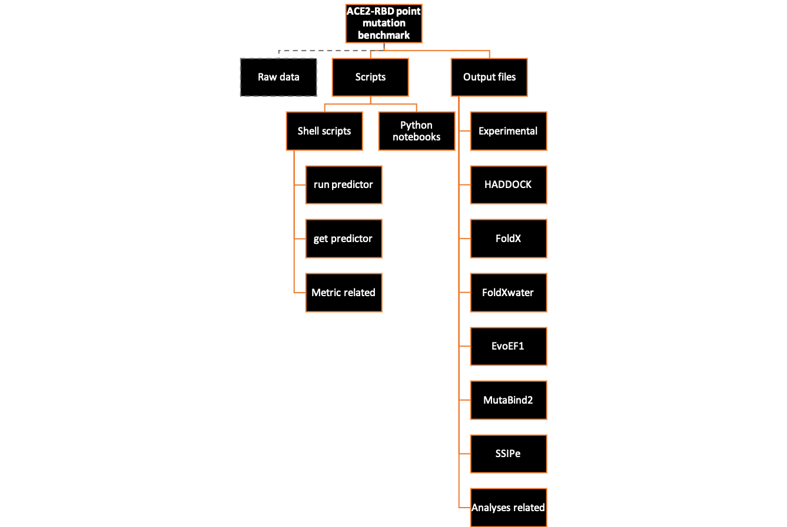

# ACE2 - RBD point mutation benchmark 
Benchmarking the structure-based binding energy predictors on human ACE2 - SARS-CoV-2 RBD binding data set.

## Motivation

Accurate prediction of binding energy change is a question of utmost importance in computational structural biology. There are many approaches developed to this aim to unveil the molecular mechanism underlying binding of two molecules and developing new therapeutic binders. In our study, we benchmarked 5 structure-based binding energy predictors; HADDOCK, FoldX, EvoEF1, MutaBind2 and SSIPe on the ACE2-RBD binding affinity data set. Further we added FoldX with water option (FoldXwater) to contribute water mediated hydrogen bonds in the interface. Thus we benchmarked six different approaches on the dataset that consist of 263 interface-point mutations. We presented prediction performance of the six approaches in this study. Additionally we assessed predictors' nature by using six different metrics which related to amino acid change upon point mutation; van der Waals volume, hydrophobicity, flexibility, physicochemical property and position in the interface.


Presenting prediction performance of binding energy predictors is crucial to reveal what we can do with computationally inexpensive and fast methods in the case of future pandemics.

## The directory structure of the repository

We released the study's files in a structured folder organization. We stored output files of six predictors (Raw data) in Drive due to limitations of GitHub storage quotas. 263 point mutated ACE2-RBD protein complexes and corresponding binding affinity values are available on this *link*. Assorted scripts related to the study were stored at the 'Scripts etc' folder. Shell scripting was used for automatization of mutation generation and file manipulation. Python notebook used for figure generation, performance and metric analyses. 'Output files' folder contains various output files of assorted scripts of the study. The purpose of the scripts and the description of output files explained in detail at the below.




### Scripts etc
#### Shell scripts

- *run_EvoEF1.csh*: Builds single amino acid mutations and computes binding affinity by using EvoEF1.
- *run_FoldX.csh*: Builds single amino acid mutations and computes binding affinity by using FoldX (FoldX commands: Repair, BuildModel, AnalyseComplex).
- *run_FoldXwater.csh*: Builds single amino acid mutations and computes binding affinity by using FoldX (FoldX commands: Repair, BuildModel, AnalyseComplex with water)
- *get_experimental_values.csh*: This script selects 263 mutations that were used in the study from binding affinity datasets of RBD and ACE2. 
- *get_HADDOCK_Prepared_dataset.csh*: Prepares HADDOCK dataset of the study from HADDOCK raw data. 
- *get_FoldX_Prepared_dataset.csh*: Prepared FoldX dataset of the study from FoldX raw data. 
- *get_FoldXwater_Prepared_dataset.csh*: Prepared FoldXwater dataset of the study from FoldXwater raw data.
- *get_EvoEF1_Prepared_dataset.csh*: Prepared EvoEF1 dataset of the study from EvoEF1 raw data.
- *get_MutaBind2_Prepared_dataset.csh*: Prepared MutaBind2 dataset of the study from MutaBind2 raw data.
- *get_SSIPe_Prepared_dataset.csh*: Prepared SSIPe dataset of the study from SSIPe raw data.
- *volume_change.sh*: Calculates van der Waals volume changes of amino acid due to point mutation.
- *hydrophobicity_change.sh*: Calculates hydrophobicity changes of amino acid due to point mutation.
- *flexibility_change.sh*: Calculates flexibility changes of amino acid due to point mutation.
- *physicochemical_class_change.sh*: Presents physicochemical class change of amino acid due to point mutation. 
- *UEP_ACE2-RBD_common_case_selection.csh*: UEP is a stand alone tool that we used for determining highly-packed residues. This script selects intersected cases between our dataset (263) and UEP suggested dataset (Raw data). 
- *plot_dataset_volume_hydrophobicity_flexibility.csh*: Prepares the datasets that used to create the figure of the volume, hydrophobicity, flexibility metrics.
- *plot_dataset_physicochemical_class_change.csh*: Prepares the dataset that used to create the figure of the physicochemical class metric.


#### Python notebooks
- *Performance_calculation.ipynb*: Calculates prediction performance of predictors on the main dataset.
- *UEP_performans_calculation.ipynb*: Calculates prediction performance of predictors on highly-packed residues -intersected dataset of main (263) and UEP suggested datasets.
- *Metric_volume_hydrophobicity_flexibility_change.ipynb*: Generates the figure and under the curve analysis of volume, hydrophobicity, flexibility metrics. 
- *Metric_physicochemical_class_change.ipynb*: Generates the figure of physicochemical class metric. 


### Output files

- *reference*: Necessary file for some shell scripts, contains case id, protein and mutation type information of corresponding point mutations in the dataset.
- *ACE2_Experimental_dataset.csv*: Contains binding affinity information of ACE2 point mutations. Output file of get_experimental_values.csh.
- *RBD_Experimental_dataset.csv*: Contains binding affinity and expression information of ACE2 point mutations. Output file of get_experimental_values.csh.
- *HADDOCK_Prepared_dataset.csv*: HADDOCK dataset of the study. Output file of get_HADDOCK_Prepared_dataset.csh.
- *FoldX_Prepared_dataset.csv*: FoldX dataset of the study. Output file of get_FoldX_Prepared_dataset.csh.
- *FoldXwater_Prepared_dataset.csv*: FoldXwater dataset of the study. Output file of get_FoldXwater_Prepared_dataset.csh.
- *EvoEF1_Prepared_dataset.csv*: EvoEF1 dataset of the study. Output file of get_EvoEF1_Prepared_dataset.csh.
- *MutaBind2_Prepared_dataset.csv*: MutaBind2 dataset of the study. Output file of get_MutaBind2_Prepared_dataset.csh.
- *SSIPe_Prepared_dataset.csv*: SSIPe dataset of the study. Output file of get_SSIPe_Prepared_dataset.csh.
- *Prediction_performances.txt*: Contains prediction performance rate of predictors on main dataset.
- *Enriched_Success_dataset*: Contains enriched and accurately predicted cases for each predictor. Output file of plot_dataset_volume_hydrophobicity_flexibility.csh.
- *Enriched_Failure_dataset*: Contains enriched and unpredicted cases for each predictor. Output file of plot_dataset_volume_hydrophobicity_flexibility.csh.
- *Depleted_Success_dataset*: Contains depleted and accurately predicted cases for each predictor. Output file of plot_dataset_volume_hydrophobicity_flexibility.csh.
- *Depleted_Failure_dataset*: Contains depleted and unpredicted cases for each predictor. Output file of plot_dataset_volume_hydrophobicity_flexibility.csh.
- *Volume_hydrophobicity_flexibility_change_figure.svg*: Figure file of volume, hydrophobicity, flexibility metrics.
- *dataset_physicochemical_class_change.csv*: Dataset for metric analyses of physicochemical class. Output file of plot_dataset_volume_hydrophobicity_flexibility.csh.
- *Physicochemical_class_change_performances.txt*: Prediction performances of predictors on each physicochemical property change classes. 
- *Physicochemical_class_change_figure.svg*: Figure file of physicochemical class metric.
- *UEP_ACE2-RBD_common_dataset.csv*: Contains UEP scores of intersected dataset of main (263) and UEP suggested datasets. Output file of UEP_ACE2-RBD_common_case_selection.csh.
- *HADDOCK_UEP_Prepared_dataset.csv*: Contains HADDOCK scores of intersected dataset of main (263) and UEP suggested datasets. Output file of UEP_ACE2-RBD_common_case_selection.csh.
- *FoldX_UEP_Prepared_dataset.csv*: Contains FoldX scores of intersected dataset of main (263) and UEP suggested datasets. Output file of UEP_ACE2-RBD_common_case_selection.csh.
- *FoldXwater_UEP_Prepared_dataset.csv*: Contains FoldXwater scores of intersected dataset of main (263) and UEP suggested datasets. Output file of UEP_ACE2-RBD_common_case_selection.csh.
- *EvoEF1_UEP_Prepared_dataset.csv*: Contains EvoEF1 scores of intersected dataset of main (263) and UEP suggested datasets. Output file of UEP_ACE2-RBD_common_case_selection.csh.
- *MutaBind2_UEP_Prepared_dataset.csv*: Contains MutaBind2 scores of intersected dataset of main (263) and UEP suggested datasets. Output file of UEP_ACE2-RBD_common_case_selection.csh.
- *SSIPe_UEP_Prepared_dataset.csv*: Contains SSIPe scores of intersected dataset of main (263) and UEP suggested datasets. Output file of UEP_ACE2-RBD_common_case_selection.csh.
- *Performances_on_highly-packed_dataset_UEP.txt*: Contains prediction performance rate of predictors on intersected dataset of main (263) and UEP suggested datasets.


## Clone the repository
```
git clone https://github.com/CSB-KaracaLab/ace2-rbd-point-mutation-benchmark
```
## License

## Acknowledgements

## Contact
ezgi.karaca@ibg.edu.tr
